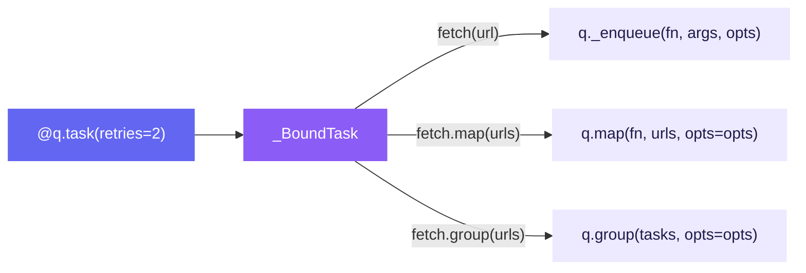

# Bound Tasks

The `@q.task()` decorator binds a callable to a queue with preset options.
Calling the decorated function submits a task instead of executing it directly.

---

## Basic Usage

```python
async with osiiso.AsyncQueue(workers=4) as q:

    @q.task(retries=2, retry_delay=0.25, timeout=10, name="fetch")
    async def fetch(url: str) -> str:
        return await client.get(url)

    # Each call submits a task and returns a TaskHandle
    handle = fetch("https://example.com")
    handle2 = fetch("https://example.org")

    summary = await q.run(strict=True)
```

---

## Bound Task Methods

A bound task exposes `map()` and `group()` methods that inherit the
decorator's options:

### `map()`

```python
@q.task(retries=2, name="download")
async def download(url: str) -> bytes: ...

handles = download.map(["https://a.com", "https://b.com", "https://c.com"])
```

### `group()`

```python
group = download.group(["https://a.com", "https://b.com"])
summary = await q.run()
values = await group.values()
```

---

## Overriding Options

Pass keyword overrides when calling the bound task to override the decorator's
defaults:

```python
@q.task(retries=2, timeout=10)
async def fetch(url: str) -> str: ...

# Default options from decorator
fetch("https://example.com")

# Override priority for this specific call
fetch("https://critical.com", priority=0)

# Override on map too
fetch.map(urls, timeout=30)
```

---

## How It Works

Under the hood, `@q.task()` wraps the function in a `_BoundTask` object:

1. The decorator resolves options from `opts=` and keyword arguments
2. Each call to the bound task calls `queue._enqueue()` with the resolved options
3. The bound task's `map()` and `group()` delegate to the queue's methods



---

## Complete Example

```python
import asyncio
import osiiso


async def main():
    events = []

    q = osiiso.AsyncQueue(
        workers=3,
        on_complete=lambda r: events.append(f"{r.name}:{r.status}"),
    )

    @q.task(retries=1, retry_delay=0.01, timeout=5, name="api-call")
    async def call_api(endpoint: str) -> dict:
        await asyncio.sleep(0.01)
        return {"endpoint": endpoint, "status": 200}

    # Submit individual tasks
    call_api("/users")
    call_api("/posts", priority=0)

    # Batch submit
    call_api.map(["/comments", "/likes", "/shares"])

    summary = await q.run(strict=True)
    summary.display()
    print("Events:", events)


osiiso.run(main())
```

---

## Next Steps

- [Task Options](task-options.md) — Configure retries, timeouts, and priorities
- [Handles & Groups](handles-and-groups.md) — Working with returned handles
