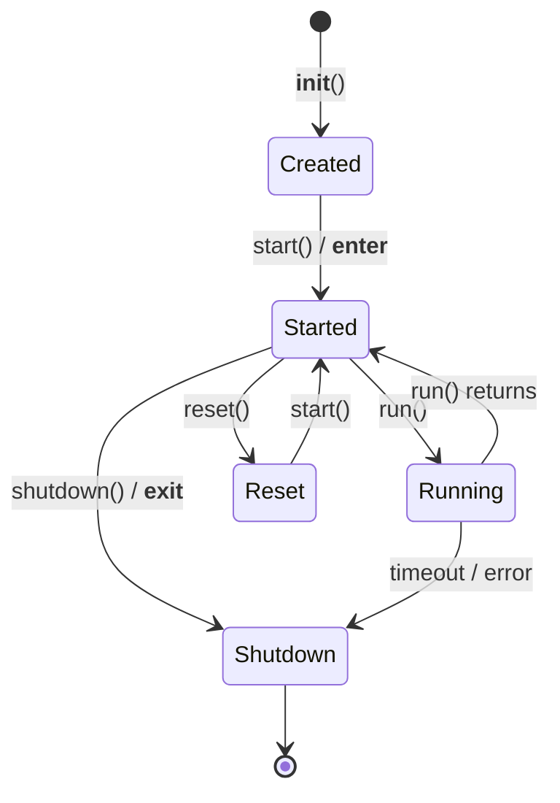

# Lifecycle & Policies

Queues have a well-defined lifecycle: create, start, submit tasks, run, and
shutdown. This guide covers context managers, manual lifecycle, modes, failure
policies, shutdown behavior, and hooks.

---

## Context Managers (Recommended)

The simplest way to manage a queue's lifecycle:

=== "AsyncQueue"

    ```python
    async with osiiso.AsyncQueue(workers=4) as q:
        q.submit(work, 1)
        summary = await q.run()
    # Queue is shut down automatically
    ```

=== "ThreadQueue"

    ```python
    with osiiso.ThreadQueue(workers=4) as q:
        q.submit(work, 1)
        summary = q.run()
    # Queue is shut down automatically
    ```

=== "ProcessQueue"

    ```python
    if __name__ == "__main__":
        with osiiso.ProcessQueue(workers=4) as q:
            q.submit(work, 1)
            summary = q.run()
    ```

On normal exit, the context manager drains the queue gracefully. On exception,
it cancels all work with `force=True`.

---

## Manual Lifecycle

For more control, manage the lifecycle explicitly:

```python
q = osiiso.AsyncQueue(workers=4)
await q.start()
q.submit(work, 1)
summary = await q.run()
await q.shutdown()
```

Use `shutdown(force=True)` to cancel all pending and active work immediately.

---

## Reset and Reuse

After a `run()`, reuse the same queue object with `reset()`:

```python
async with osiiso.AsyncQueue(workers=4) as q:
    q.submit(fetch, "first-batch")
    await q.run()

    q.reset()

    q.submit(fetch, "second-batch")
    await q.run()
```

!!! note "What `reset()` clears"
    `reset()` clears results, handles, and internal state. It reopens the queue
    for new submissions. You cannot call `reset()` while `run()` is in progress.

Use `clear_results()` to free stored result history without resetting the entire
queue:

```python
q.clear_results()  # Free memory, keep queue open
```

---

## Queue Modes

### Finite Mode (Default)

`mode="finite"` drains all submitted tasks and stops:

```python
q = osiiso.AsyncQueue(mode="finite")
```

This is the default. Workers process all tasks and then `run()` returns.

### Infinite Mode

`mode="infinite"` keeps workers alive until shutdown or timeout. Use this when
producers keep adding work while workers are active:

```python
q = osiiso.AsyncQueue(mode="infinite", timeout=60)
```

In infinite mode, `run()` blocks until:

- `shutdown()` is called, or
- The `timeout` expires

---

## Failure Policies

### Continue (Default)

`fail_policy="continue"` records failures and keeps processing remaining tasks:

```python
q = osiiso.ThreadQueue(fail_policy="continue")
summary = q.run()
# summary.failed may be > 0, but all tasks were attempted
```

### Fail First

`fail_policy="fail_first"` cancels remaining eligible work after the first failure:

```python
summary = q.run(fail_policy="fail_first")
# Remaining tasks are cancelled after the first failure
```

You can set the policy at construction time or override it per-run:

```python
q = osiiso.AsyncQueue(fail_policy="continue")
summary = await q.run(fail_policy="fail_first")  # Override for this run
```

---

## Shutdown Behavior

The `on_exit` parameter controls what happens when a timeout or forced shutdown
occurs:

### Complete Priority (Default)

`on_exit="complete_priority"` cancels ordinary pending work but lets
`must_complete=True` tasks finish:

```python
q.submit(save_checkpoint, data, must_complete=True, priority=0)
q.submit(optional_cleanup, priority=5)

summary = q.run(timeout=5)
# save_checkpoint finishes; optional_cleanup may be cancelled
```

### Cancel

`on_exit="cancel"` cancels **everything** it can, including `must_complete`
tasks:

```python
q = osiiso.AsyncQueue(on_exit="cancel")
```

---

## Lifecycle Hooks

Hooks are **synchronous callbacks** that fire at key points in task execution.
Exceptions raised inside hooks are logged but never crash the queue.

```python
def on_start(handle):
    print(f"Starting: {handle.name}")

def on_complete(result):
    print(f"Done: {result.name} → {result.status} ({result.duration:.3f}s)")

def on_retry(handle, exc):
    print(f"Retrying: {handle.name} after {exc}")

q = osiiso.AsyncQueue(
    on_start=on_start,
    on_complete=on_complete,
    on_retry=on_retry,
)
```

| Hook | Signature | When |
|------|-----------|------|
| `on_start` | `(handle) -> None` | Just before a task begins executing |
| `on_complete` | `(result) -> None` | Immediately after a task finishes (any status) |
| `on_retry` | `(handle, exception) -> None` | Before a retry attempt |

---

## Lifecycle Diagram



---

## Next Steps

- [Bound Tasks](bound-tasks.md) — Decorator-based task registration
- [Results & Summaries](results-and-summaries.md) — Inspecting execution outcomes
