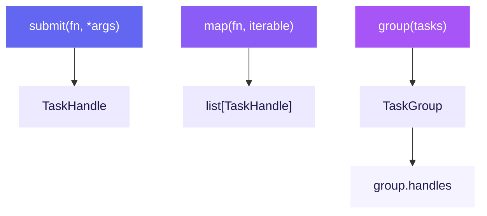

# Task Submission

osiiso provides three methods for submitting tasks to a queue: `submit()`,
`map()`, and `group()`. Each returns handles that let you track, wait for, and
cancel individual tasks.

---

## `submit()` — Single Task

Use `submit()` when you have one task to enqueue. It returns a handle immediately.

```python
handle = q.submit(fetch_user, "ada", retries=3, timeout=10, name="fetch-user")
```

**Positional arguments** after the callable are forwarded to the function.
**Keyword arguments** that match [`TaskOptions`](task-options.md) fields are
extracted as task configuration — they are _not_ passed to the function.

!!! tip "Passing keyword arguments to the function"
    Use `functools.partial` when your function needs keyword arguments:

    ```python
    from functools import partial

    q.submit(partial(fetch_user, include_email=True), "ada", retries=3)
    ```

---

## `map()` — One Callable, Many Inputs

Use `map()` to apply a single callable across an iterable of inputs.

```python
q.map(download, urls, retries=2, group_id="downloads")
```

### Input Interpretation

`map()` interprets each element based on its type:

| Element Type | Behavior | Example |
|--------------|----------|---------|
| **Plain value** | Passed as a single positional arg | `q.map(fetch, ["users", "posts"])` |
| **Tuple** | Unpacked as positional args | `q.map(add, [(1, 2), (3, 4)])` |
| **Dict / Mapping** | Passed as keyword args | `q.map(request, [{"method": "GET", "url": "..."}])` |

```python
# Single positional arg per call
q.map(fetch, ["users", "posts", "comments"])

# Multiple positional args via tuples
q.map(add, [(1, 2), (3, 4), (5, 6)])

# Keyword args via dicts
q.map(request, [{"method": "GET", "url": "https://example.com"}])
```

!!! warning "Dicts as positional arguments"
    If your function takes a dict as its argument (not keyword args), wrap it
    in a tuple:

    ```python
    q.map(process_record, [(record,) for record in records])
    ```

---

## `group()` — Named Batches

Use `group()` when you need a named batch of tasks — especially useful for
heterogeneous work where each entry has a different callable.

### Heterogeneous Tasks

```python
group = q.group(
    [
        (extract, "db"),
        (transform, raw_records),
        (load, destination),
    ],
    group_id="etl-batch-1",
)
```

Each entry is a tuple of `(callable, *args)`.

### Homogeneous Tasks

`group()` also supports the `group(fn, iterable)` form for a single callable
over many inputs — like `map()`, but with a group handle:

```python
group = q.group(fetch, ["users", "posts", "comments"], group_id="api-calls")
```

### Working with Groups

=== "Async (AsyncQueue)"

    ```python
    summary = await q.run()
    group_summary = await group.wait()       # RunSummary for this group
    values = await group.values()            # Raises on failure
    cancelled = group.cancel()               # Cancel remaining tasks
    ```

=== "Sync (ThreadQueue / ProcessQueue)"

    ```python
    summary = q.run()
    group_summary = group.wait(timeout=30)   # RunSummary for this group
    values = group.values()                  # Raises on failure
    cancelled = group.cancel()               # Cancel remaining tasks
    ```

---

## Using `TaskOptions`

Instead of passing options inline, create reusable [`TaskOptions`](task-options.md)
objects:

```python
from osiiso import TaskOptions

retry_opts = TaskOptions(retries=3, retry_delay=0.5, backoff=2, timeout=10)

q.submit(fetch, url, opts=retry_opts)
q.map(download, urls, opts=retry_opts)
q.group(tasks, opts=retry_opts, group_id="batch")
```

Inline overrides take precedence over `opts`:

```python
q.submit(fetch, url, opts=retry_opts, priority=0)  # priority=0 wins
```

---

## Submission Summary



---

## Next Steps

- [Task Options](task-options.md) — Retries, timeouts, priorities, scheduling
- [Handles & Groups](handles-and-groups.md) — Awaiting, inspecting, and cancelling tasks
